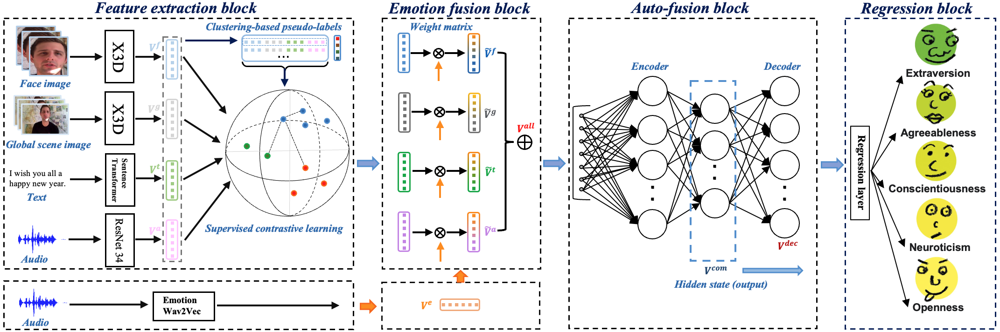

# PSR

This is the official implementation for the paper "EMP: Emotion-guided Multi-modal Fusion and Contrastive
Learning for Personality Traits Recognition".

# Structure of EMP


## Table of Contents

- [Dependencies](#security)
- [Requirement](#background)
- [Dataset](#dataset)
- [Usage](#usage)

## Dependencies

- Python 3.9.1
- pytorch-lightning 1.7.2   
- Linux 5.11.0-46-generic

Please follow the paper to pre-process the data. The batch size will influence the performance and please see implementation detials in paper.

## Requirement
- We use sentence transfomer for text feature extraction. [Sentence Embedding](https://huggingface.co/cardiffnlp/twitter-roberta-base-emotion)
- We use large X3D network for visual features extraction. [X3D](https://github.com/facebookresearch/pytorchvideo)


## Dataset
Chalearn first impressions dataset can be found in [First impressions](https://chalearnlap.cvc.uab.cat/dataset/24/description/).

ELEA dataset can be found on this official website [ELEA](https://www.idiap.ch/en/dataset/elea) and you need to apply it.


## Usage

### Train the model

```
ulimit -SHn 51200
python main.py --accelerator 'gpu' --devices 1  
```

### Evaluate the model
you need to use
```
trainer.test(model, data_module)
```

then 
```
ulimit -SHn 51200
python main.py --accelerator 'gpu' --devices 1  
```
